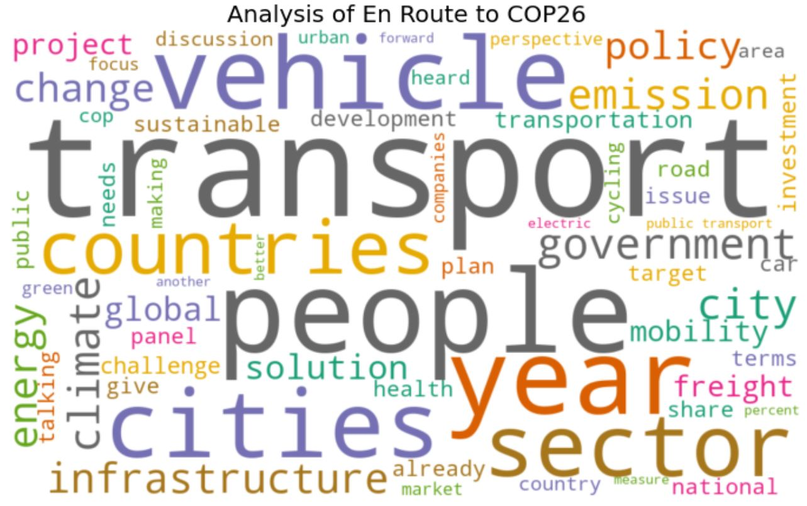

# whats-all-the-blablabla
A small project analyzing what we are talking about at transport conferences

# Project description

The idea of this project is to summarize and analyze the content of high-level events on transport and climate change. It fetches the transcripts of Youtube videos and summarizes them as word clouds. Now that all major conferences are being held online and the recordings are uploaded to YouTube, it is possible to get their content. It can show the main themes of a conference and how the key topics changed over time.

The code combines the packages [Youtube-Transcript-API developed by @jdepoix](https://github.com/jdepoix/youtube-transcript-api) and [Wordcloud by @amueller](https://github.com/amueller/word_cloud). It extracts the automatic transcript of every included video, deletes stop words as well as unimportant words and puts the most mentioned words in a word cloud. The size of the words represents how often they have been mentioned throughout the event.

# Analysis

As an example, I analyzed the following events:
* SLOCAT's COP23 Transport Talk Shows (November 2017)
* SLOCAT's and Transport Decarbonisation Alliance's En Route to COP26 (December 2020)
* International Transport Forum's 2021 Summit (May 2021)
* GIZ Transport and Climate Change Week (June 2021)

Each event consists of several sessions and all of them focus on transport. They have been selected as all (or nearly all) of the sessions convened have been uploaded and provide automatic transcripts. 
The first analysis shows the 2017 high-level events on sustainable, low carbon transport during COP23:

The word clouds shows that the COP23 Transport Talk Shows focused on people-centered mobility, finance, sustainability and various stakeholders (cities, countries, companies and governments). Three years later, the En Route to COP26 events by SLOCAT and the Transport Decarbonisation Alliance results in a very similar word cloud despite being three years apart:

